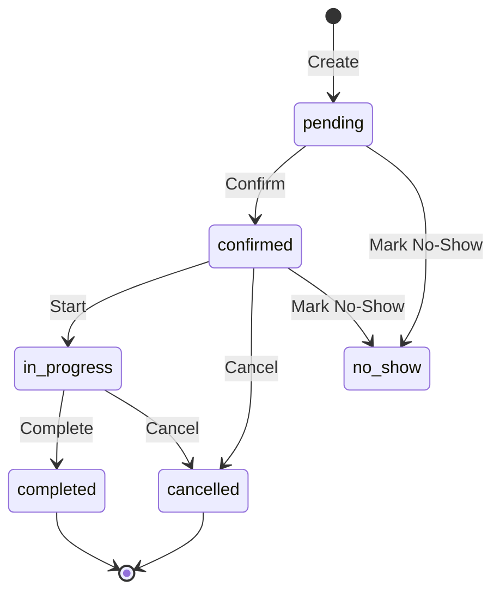

# Feature: Merchant Bookings

**Date Implemented**: Various dates (ongoing development)  
**Implemented By**: Original developers + Claude Code Sessions  
**Risk Level**: HIGH  
**Related Ticket/Issue**: Core booking functionality for merchants

## 📋 Quick Reference

**What It Does**: Complete booking management system for merchants - create, edit, reschedule, and cancel bookings  
**Where To Find It**: Multiple entry points across merchant dashboard  
**How To Test It**: Use Quick Booking button, Calendar view, or Bookings page  
**Key Dependencies**: React Query, date-fns, DnD Kit, BookingContext

## 🎯 Business Context

### Why This Feature Exists
Merchants need a seamless way to create and manage bookings from their dashboard. This includes handling walk-ins, phone bookings, and modifications to existing bookings - all while maintaining real-time staff availability and preventing double-bookings.

### User Story
As a merchant, I want to quickly create bookings from anywhere in my dashboard, edit existing bookings, and handle cancellations efficiently so that I can manage my daily operations smoothly.

### Success Metrics
- [ ] Booking creation takes < 30 seconds
- [ ] Staff availability prevents double-bookings
- [ ] Walk-in customers can be booked without full details
- [ ] Status transitions are clear and intuitive
- [ ] Payment tracking is integrated seamlessly

## 🏗️ Technical Implementation

### Architecture Decision
The system uses a global BookingContext provider that allows booking creation from anywhere in the app, combined with slide-out panels that don't interrupt the current workflow. This provides a consistent experience regardless of entry point.

### Files Modified/Created
```
CORE COMPONENTS:
- apps/merchant-app/src/components/BookingSlideOut.tsx - Main booking creation wizard
- apps/merchant-app/src/components/BookingDetailsSlideOut.tsx - View/edit existing bookings
- apps/merchant-app/src/contexts/booking-context.tsx - Global booking state management
- apps/merchant-app/src/components/BookingActions.tsx - Reusable action buttons

ENTRY POINTS:
- apps/merchant-app/src/components/layout/topbar.tsx - Quick Booking button
- apps/merchant-app/src/components/calendar/refactored/CalendarPage.tsx - Calendar slots
- apps/merchant-app/src/app/(dashboard)/bookings/BookingsManager.tsx - Bookings page

SUPPORTING:
- (Removed Sep 2025) apps/merchant-app/src/lib/services/mock-availability.service.ts - superseded by real availability endpoints
- apps/merchant-app/src/lib/constants/booking-constants.ts - Status/state constants
- apps/merchant-app/src/components/customers/CustomerSearchInput.tsx - Customer search
```

### Database Changes
```sql
-- Uses existing Booking schema with key fields:
-- status: ENUM ('pending', 'confirmed', 'in_progress', 'completed', 'cancelled', 'no_show')
-- staffId: Can be null for unassigned bookings
-- cancellationReason: Tracks why booking was cancelled
-- paymentStatus: Tracks payment state
```

### API Changes
```typescript
// Booking Creation
POST /api/v2/bookings
  Request: {
    customerId: string
    locationId: string
    services: Array<{
      serviceId: string
      staffId: string
    }>
    startTime: string (ISO)
    notes?: string
  }
  
// Booking Updates
PATCH /api/v2/bookings/:id
  Request: Partial<Booking>
  
// Status-Specific Endpoints
PATCH /api/v2/bookings/:id/start - Start in-progress
PATCH /api/v2/bookings/:id/complete - Mark completed
PATCH /api/v2/bookings/:id/cancel - Cancel with reason
  Request: { reason?: string }
  
// Reschedule
PATCH /api/v2/bookings/:id/reschedule
  Request: {
    startTime: string
    staffId?: string
  }
```

### Key Components/Functions

```typescript
BookingSlideOut
  Purpose: 4-step wizard for creating new bookings
  Steps: DateTime → Service → Customer → Confirm
  Features:
    - Real-time staff availability checking
    - "Next Available" staff assignment
    - Walk-in customer support
    - Service duration calculation
    
BookingDetailsSlideOut  
  Purpose: View and edit existing bookings
  Features:
    - Inline editing of all fields
    - Status transition management
    - Payment tracking
    - Cancellation with reasons
    
BookingContext
  Purpose: Global state for booking slideout
  Features:
    - Accessible from any component
    - Loads staff/services/customers
    - Handles merchant settings
    
getAvailableStaff()
  Purpose: Check staff availability for time slot
  Returns: {
    available: Staff[]
    unavailable: Array<{staff, reason}>
    assignedStaff?: Staff (for Next Available)
  }
```

## 📖 Feature Documentation

### Creating a New Booking

#### Entry Points
1. **Quick Booking Button** (Top Navigation)
   - Always visible across all pages
   - Opens with current date/time pre-selected
   - Uses global BookingContext

2. **Calendar View**
   - Click any empty time slot
   - Pre-fills date, time, and staff
   - Context-aware based on calendar column

3. **Bookings Page**
   - Dedicated Quick Booking button
   - Opens with smart defaults

#### Booking Creation Wizard

**Step 1: Date & Time Selection**
```typescript
// Staff selection with real-time availability
- "Next Available" option auto-assigns based on availability
- Staff shown with availability status
- Visual indicators: ✓ Available, "Booked", "Day off"
- Date/time pickers with 15-minute intervals
- Optional notes field for special requests
```

**Step 2: Service Selection**
```typescript
// Service cards showing:
- Service name and category badge
- Duration in minutes
- Price
- Visual selection state
- Multiple service support (future)
```

**Step 3: Customer Selection**
```typescript
// Three pathways:
1. Search existing customers
   - Type-ahead search by name/phone
   - Recent customers shown first
   
2. Create new customer
   - First Name (required)
   - Last Name (optional)
   - Phone (optional)
   - Email (optional)
   
3. Walk-in customer
   - Auto-generates name: "Walk-in MMM-DD-HH:MMAM"
   - No phone number required
   - No email required
```

**Step 4: Confirmation**
```typescript
// Summary showing:
- Customer details
- Service with duration/price
- Staff assignment (or "auto-assigned")
- Date & time
- Any notes
- Warning if no staff available
```

### Staff Assignment Logic

#### "Next Available" Algorithm
```javascript
1. Get all staff members
2. Filter by availability:
   - Not already booked at requested time
   - Working hours include requested time
   - Not on leave/day off
3. Sort by:
   - Least bookings that day (load balancing)
   - Random selection if tied
4. Return first available staff member
```

#### Unassigned Bookings
- Controlled by merchant setting: `allowUnassignedBookings`
- When `false`: "Unassigned" staff filtered from dropdown
- Calendar shows unassigned column only when enabled
- API validates against merchant settings

### Editing Existing Bookings

#### Access Methods
1. Click booking in calendar → Details slideout
2. Click booking in list → Details slideout
3. Direct URL: `/bookings/[id]/edit`

#### Editable Fields
```typescript
// Inline editing for:
- Customer (change customer)
- Service (modify service)
- Staff (reassign)
- Date/Time (reschedule)
- Duration (extend/shorten)
- Notes (update)
- Payment status
```

#### Reschedule Process
1. Click date/time in details view
2. Opens calendar picker
3. Shows staff availability for new time
4. Confirms reschedule with conflict check
5. Sends notifications if enabled

### Booking Status Management

#### Status Transitions


#### Status Actions
- **Confirm**: Sends confirmation to customer
- **Start**: Marks service in progress
- **Complete**: Finalizes service, ready for payment
- **Cancel**: Requires reason, sends cancellation notice
- **No-Show**: Tracks pattern for future reference

### Cancellation Process

#### Cancellation Reasons
```typescript
const CANCELLATION_REASONS = [
  'Customer requested',
  'Staff unavailable', 
  'Weather',
  'No show',
  'Other'
];
```

#### Cancellation Flow
1. Click "Cancel Booking" in actions
2. Select reason from dropdown
3. Optional: Add additional notes
4. Confirm cancellation
5. System:
   - Updates status to 'cancelled'
   - Records reason and timestamp
   - Sends notification if enabled
   - Frees up staff availability

### Payment Integration

#### Payment States
- `pending`: No payment recorded
- `partial`: Deposit or partial payment made
- `paid`: Fully paid
- `refunded`: Payment refunded

#### Payment Actions
1. **Mark as Paid**: Quick action for cash/external payments
2. **Process Payment**: Opens payment dialog
3. **Create Order**: Links to POS for product sales

## 🔗 Integration Points

### Upstream Dependencies
- [ ] Authentication - Valid merchant session required
- [ ] Merchant Settings - For availability rules, timezone
- [ ] Staff Working Hours - For availability calculation
- [ ] Service Definitions - Duration and pricing

### Downstream Impact
- [ ] Calendar View - Shows created/updated bookings
- [ ] Customer Records - Updates booking history
- [ ] Analytics - Feeds booking metrics
- [ ] Notifications - Triggers confirmations/reminders
- [ ] Payment System - Processes booking payments

### Critical Paths
1. Create: Validate → Check availability → Create → Update calendar
2. Edit: Load booking → Validate changes → Update → Refresh views
3. Cancel: Confirm reason → Update status → Free availability → Notify

## 🧪 Testing

### Manual Testing Checklist

**Booking Creation**
- [ ] Quick Booking opens from topbar
- [ ] Calendar slot click pre-fills correctly
- [ ] Staff availability updates in real-time
- [ ] "Next Available" assigns appropriate staff
- [ ] Walk-in customer generates correct name format
- [ ] Service selection updates duration/price
- [ ] Confirmation shows accurate summary
- [ ] Booking appears immediately in calendar

**Booking Editing**
- [ ] Details slideout opens on click
- [ ] All fields are editable inline
- [ ] Reschedule shows availability
- [ ] Changes save without page reload
- [ ] Calendar updates reflect changes

**Booking Cancellation**
- [ ] Cancel button prompts for reason
- [ ] Reason is recorded in system
- [ ] Booking status updates to cancelled
- [ ] Staff availability is freed up
- [ ] Cannot edit cancelled bookings

**Edge Cases**
- [ ] No staff available shows warning
- [ ] Past date/time selection prevented
- [ ] Double-booking prevented
- [ ] Network errors show toast
- [ ] Form validation messages clear

## ⚠️ Edge Cases & Gotchas

### Handled Edge Cases
- ✅ No available staff - Shows warning, prevents confirmation
- ✅ Double-booking - Real-time availability prevents conflicts
- ✅ Past dates - Date picker prevents selection
- ✅ Walk-in customers - Auto-generates unique names
- ✅ Network failures - Retries with exponential backoff

### Known Limitations
- ⚠️ Multiple services require sequential booking
- ⚠️ No recurring booking support yet
- ⚠️ Group bookings not implemented
- ⚠️ No waiting list functionality
- ⚠️ Timezone changes can cause display issues

### Performance Notes
- Staff availability checks cached for 30 seconds
- Customer search debounced by 300ms
- Slideout animations GPU-accelerated
- Form state persisted during navigation

## 🐛 Debugging Guide

### Common Issues

**Issue**: "Next Available" not selecting anyone
- Check: Staff working hours configured
- Check: Existing bookings at that time
- Check: Console for availability service errors
- Fix: Ensure at least one staff member available

**Issue**: Walk-in customer name collision
- Check: Multiple bookings created same second
- Fix: Names include seconds for uniqueness

**Issue**: Booking not appearing in calendar
- Check: Date filter on calendar view
- Check: Staff filter excluding booking
- Check: Network tab for API errors
- Fix: Refresh calendar data

### Debug Commands
```bash
# Check booking creation
pm2 logs merchant-app | grep -E "BookingSlideOut|BookingContext"

# Monitor availability checks  
pm2 logs merchant-app | grep "getAvailableStaff"

# Track API calls
pm2 logs api | grep -E "POST.*bookings|PATCH.*bookings"
```

### Key Log Entries
```
[BookingSlideOut] Opening with initial data...
[BookingContext] Loading staff/services/customers...
[availability] Checking staff for [time]
[BookingSlideOut] Submitting booking...
[BookingContext] Booking created successfully
```

## 🔄 Maintenance Notes

### Safe to Modify
- ✅ UI labels and button text
- ✅ Walk-in name format
- ✅ Step order in wizard
- ✅ Cancellation reason options
- ✅ Toast messages

### Modify with Caution
- ⚠️ Availability algorithm - Complex logic
- ⚠️ Status transitions - Must match backend
- ⚠️ API payload structure - Backend dependent
- ⚠️ Date/time handling - Timezone sensitive

### Do NOT Modify Without Full Understanding
- ❌ BookingContext provider - Global state critical
- ❌ Staff assignment logic - Affects scheduling
- ❌ Payment integration - Financial impact
- ❌ Notification triggers - Customer communication

## 📊 Monitoring

### Metrics to Track
- Booking creation time (target: < 30s)
- "Next Available" assignment accuracy
- Cancellation rate and reasons
- Walk-in vs regular customer ratio
- Failed booking attempts

### Alerts to Configure
- Availability service errors > 5/min
- Booking creation failures > 10/hour
- No available staff situations > 20/day

## 🔗 Related Documentation

- [BookingsManager Documentation](./merchant-bookings-dashboard.md)
- [Calendar View Documentation](./calendar.md)
- [Booking States Documentation](./booking-status-lifecycle.md)
- [Customer Booking App](./customer-booking-app.md)
- [Staff Management](./staff-management.md)

## 📝 Additional Notes

### Recent Improvements (2025-07)
1. Fixed "Unassigned" staff filtering in Quick Booking
2. Added walk-in customer support with auto-naming
3. Improved staff availability real-time checking
4. Enhanced error handling and user feedback
5. Made phone and email fields optional for all customers
6. Made lastName optional in customer creation
7. Fixed phone validation to allow empty values
8. Walk-in customers no longer have placeholder phone numbers

### Recommended Future Enhancements
1. **Recurring Bookings**: Weekly/monthly repeat options
2. **Group Bookings**: Multiple customers, one time slot
3. **Waiting List**: Auto-assign when cancellations occur
4. **Smart Suggestions**: ML-based service recommendations
5. **Conflict Resolution**: Handle double-booking scenarios
6. **SMS Integration**: Direct booking confirmations
7. **Package Bookings**: Multi-service bundles
8. **Resource Management**: Room/equipment assignment

### Mobile Considerations
- Slideout panels optimized for tablet/mobile
- Touch-friendly date/time pickers
- Swipe gestures for step navigation
- Responsive form layouts

---

**Last Updated**: 2025-07-03  
**Next Review Date**: 2025-10-02

<!-- 
Template Usage Notes:
- Focus on merchant-side booking operations
- Include all creation and modification flows  
- Document integration with calendar and list views
- Keep staff availability logic well-documented
-->
